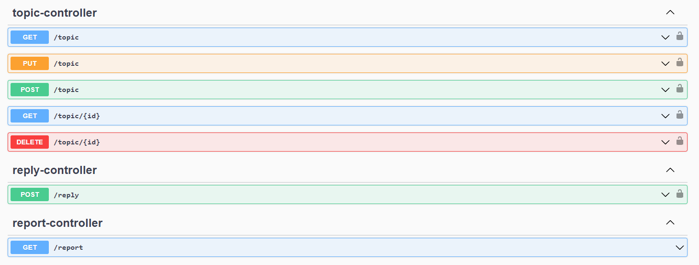

<h1 align="center">
    
</h1>

<h1 align="center">
    
</h1>

# Índice

- [Sobre](#-sobre)
- [Tecnologias utilizadas](#-tecnologias-utilizadas)

## 🔖 Sobre

Microserviço de um fórum, onde você consegue postar dúvidas e responder dúvidas já existentes.

---

## 💻 Tecnologias utilizadas

O projeto foi desenvolvido utilizando as seguintes tecnologias:

- [Flyway](https://flywaydb.org)
- [Kotlin](https://kotlinlang.org)
- [Mailtrap](https://mailtrap.io)
- [MySQL](https://www.mysql.com)
- [Redis](https://redis.io)
- [Spring Framework](https://spring.io)
- [Swagger](https://swagger.io)

---

<h3 align="center">
  Feito com ❤️ por Leonardo Santana
</h3>
